# OptiCrew Database Entity Relationship Diagram (ERD)

**Project:** OptiCrew Cleaning Service Management System
**Document Version:** 1.0
**Date:** November 4, 2025
**Database Engine:** MySQL 10.4.32-MariaDB
**Framework:** Laravel 10
**Purpose:** Thesis Chapter 3 - Database ERD Documentation

---

## Table of Contents

1. [Overview](#overview)
2. [Format 1: DBML Code for dbdiagram.io](#format-1-dbml-code-for-dbdiagramio)
3. [Format 2: Mermaid Diagram Code](#format-2-mermaid-diagram-code)
4. [Relationship Summary](#relationship-summary)
5. [Usage Instructions](#usage-instructions)

---

## Overview

This document contains two complete Entity Relationship Diagram (ERD) formats for the OptiCrew database:

- **DBML Format**: For use with https://dbdiagram.io to generate professional, interactive ERDs
- **Mermaid Format**: For rendering in Markdown viewers, GitHub, documentation tools, and thesis documents

**Database Statistics:**
- Total Tables: 27 active tables
- Core System: 1 table (users)
- Client Management: 5 tables
- Employee Management: 4 tables
- Task & Scheduling: 3 tables
- Optimization System: 6 tables
- Monitoring & Alerts: 2 tables
- Administrative: 3 tables
- System Tables: 3 tables

---

## Format 1: DBML Code for dbdiagram.io

### Instructions:
1. Visit https://dbdiagram.io
2. Click "New Diagram"
3. Delete the default template
4. Copy and paste the entire DBML code below
5. The diagram will auto-generate with proper relationships
6. Use the tools to arrange, zoom, and export as PNG/SVG/PDF

### Color Coding Suggestions:
- Core System: Blue (#2196F3)
- Client Management: Green (#4CAF50)
- Employee Management: Orange (#FF9800)
- Task & Scheduling: Purple (#9C27B0)
- Optimization System: Red (#F44336)
- Monitoring & Alerts: Yellow (#FFC107)
- Administrative: Teal (#009688)
- System Tables: Gray (#9E9E9E)

---

### DBML Code:

```dbml
// OptiCrew Cleaning Service Management System
// Entity Relationship Diagram (ERD)
// Generated: November 4, 2025
// Total Tables: 27

//==========================================
// TABLE GROUP 1: CORE SYSTEM
//==========================================

Table users {
  id bigint [pk, increment]
  name varchar(255) [not null]
  username varchar(255) [unique, null]
  email varchar(255) [unique, not null]
  profile_picture varchar(255) [null]
  phone varchar(255) [null]
  location varchar(255) [null]
  email_verified_at timestamp [null]
  password varchar(255) [not null]
  role enum [not null, note: 'admin, employee, external_client, company']
  remember_token varchar(100) [null]
  created_at timestamp [null]
  updated_at timestamp [null]
  deleted_at timestamp [null]

  Note: 'Central authentication and authorization table. Implements RBAC for all system users.'
}

//==========================================
// TABLE GROUP 2: CLIENT MANAGEMENT
//==========================================

Table clients {
  id bigint [pk, increment]
  user_id bigint [ref: > users.id, null]
  first_name varchar(255) [not null]
  last_name varchar(255) [not null]
  middle_initial varchar(5) [null]
  birthdate date [null]
  security_question_1 varchar(255) [null]
  security_answer_1 varchar(255) [null]
  security_question_2 varchar(255) [null]
  security_answer_2 varchar(255) [null]
  client_type enum [null, note: 'personal, company']
  company_name varchar(255) [null]
  email varchar(255) [null]
  phone_number varchar(255) [null]
  business_id varchar(20) [null]
  street_address varchar(255) [null]
  postal_code varchar(10) [null]
  city varchar(100) [null]
  district varchar(100) [null]
  address text [null]
  billing_address text [null]
  einvoice_number varchar(100) [null]
  is_active tinyint(1) [not null, default: 1]
  created_at timestamp [null]
  updated_at timestamp [null]
  deleted_at timestamp [null]

  Note: 'Client details for personal and company service requesters. Extends users table.'
}

Table client_appointments {
  id bigint [pk, increment]
  client_id bigint [ref: > clients.id, not null]
  is_company_inquiry tinyint(1) [not null, default: 0]
  booking_type varchar(255) [not null]
  service_type varchar(255) [not null]
  company_service_types longtext [null, note: 'JSON array']
  service_date date [not null]
  service_time time [not null]
  is_sunday tinyint(1) [not null, default: 0]
  is_holiday tinyint(1) [not null, default: 0]
  number_of_units int [not null]
  unit_size varchar(255) [not null]
  unit_details longtext [null, note: 'JSON array']
  cabin_name varchar(255) [not null]
  special_requests text [null]
  other_concerns text [null]
  quotation decimal(10,2) [not null]
  vat_amount decimal(10,2) [not null]
  total_amount decimal(10,2) [not null]
  status enum [not null, default: 'pending', note: 'pending, approved, rejected, completed, cancelled']
  assigned_team_id bigint [null]
  recommended_team_id bigint [null]
  rejection_reason text [null]
  approved_by bigint [ref: > users.id, null]
  approved_at timestamp [null]
  rejected_by bigint [ref: > users.id, null]
  rejected_at timestamp [null]
  client_notified tinyint(1) [not null, default: 0]
  notified_at timestamp [null]
  created_at timestamp [null]
  updated_at timestamp [null]

  Note: 'Client appointment/booking requests with quotations and status tracking.'
}

Table quotations {
  id bigint [pk, increment]
  booking_type enum [not null, note: 'personal, company']
  cleaning_services longtext [null, note: 'JSON array']
  date_of_service date [null]
  duration_of_service int [null]
  type_of_urgency varchar(255) [null]
  property_type varchar(255) [not null]
  floors int [not null, default: 1]
  rooms int [not null, default: 1]
  people_per_room int [null]
  floor_area decimal(10,2) [null]
  area_unit varchar(255) [null]
  location_type varchar(255) [null]
  street_address varchar(255) [null]
  postal_code varchar(10) [null]
  city varchar(255) [null]
  district varchar(255) [null]
  latitude decimal(10,7) [null]
  longitude decimal(10,7) [null]
  company_name varchar(255) [null]
  client_name varchar(255) [not null]
  phone_number varchar(255) [not null]
  email varchar(255) [not null]
  estimated_price decimal(10,2) [null]
  vat_amount decimal(10,2) [null]
  total_price decimal(10,2) [null]
  pricing_notes text [null]
  status enum [not null, default: 'pending_review', note: 'pending_review, under_review, quoted, accepted, rejected, converted']
  reviewed_by bigint [ref: > users.id, null]
  reviewed_at timestamp [null]
  quoted_by bigint [ref: > users.id, null]
  quoted_at timestamp [null]
  admin_notes text [null]
  rejection_reason text [null]
  appointment_id bigint [null]
  converted_by bigint [ref: > users.id, null]
  converted_at timestamp [null]
  client_responded_at timestamp [null]
  client_message text [null]
  created_at timestamp [null]
  updated_at timestamp [null]
  deleted_at timestamp [null]

  Note: 'Landing page quotation requests from potential clients.'
}

Table feedback {
  id bigint [pk, increment]
  client_id bigint [ref: > clients.id, not null]
  service_type varchar(255) [not null]
  overall_rating int [not null]
  quality_rating int [not null]
  cleanliness_rating int [not null]
  punctuality_rating int [not null]
  professionalism_rating int [not null]
  value_rating int [not null]
  comments text [not null]
  would_recommend tinyint(1) [not null, default: 0]
  created_at timestamp [null]
  updated_at timestamp [null]

  Note: 'Multi-dimensional customer feedback and ratings (1-5 scale).'
}

Table contracted_clients {
  id bigint [pk, increment]
  user_id bigint [ref: > users.id, null]
  name varchar(255) [unique, not null]
  email varchar(255) [null]
  phone varchar(255) [null]
  address varchar(255) [null]
  business_id varchar(255) [null]
  contract_start date [null]
  contract_end date [null]
  latitude decimal(10,8) [null]
  longitude decimal(11,8) [null]
  created_at timestamp [null]
  updated_at timestamp [null]
  deleted_at timestamp [null]

  Note: 'Long-term commercial clients with recurring service contracts.'
}

//==========================================
// TABLE GROUP 3: EMPLOYEE MANAGEMENT
//==========================================

Table employees {
  id bigint [pk, increment]
  user_id bigint [ref: > users.id, not null]
  skills longtext [not null, note: 'JSON array']
  is_active tinyint(1) [not null, default: 1]
  is_day_off tinyint(1) [not null, default: 0]
  is_busy tinyint(1) [not null, default: 0]
  efficiency decimal(3,2) [not null, default: 1.00, note: '0.5 to 2.0']
  has_driving_license tinyint(1) [not null, default: 0]
  years_of_experience int [not null, default: 0]
  salary_per_hour decimal(8,2) [not null, default: 13.00]
  months_employed int [not null, default: 0]
  created_at timestamp [null]
  updated_at timestamp [null]
  deleted_at timestamp [null]

  Note: 'Employee details including skills, efficiency metrics, and availability.'
}

Table attendances {
  id bigint [pk, increment]
  employee_id bigint [ref: > employees.id, not null]
  clock_in timestamp [null]
  clock_out timestamp [null]
  clock_in_latitude decimal(10,8) [null]
  clock_in_longitude decimal(11,8) [null]
  clock_out_latitude decimal(10,8) [null]
  clock_out_longitude decimal(11,8) [null]
  clock_in_distance decimal(8,2) [null]
  clock_out_distance decimal(8,2) [null]
  total_minutes_worked int [null]
  created_at timestamp [null]
  updated_at timestamp [null]

  Indexes {
    (employee_id, clock_in) [unique]
  }

  Note: 'Employee clock-in/out records with geolocation verification.'
}

Table employee_performance {
  id bigint [pk, increment]
  employee_id bigint [ref: > employees.id, not null]
  date date [not null]
  tasks_completed int [not null, default: 0]
  total_performance_score decimal(8,4) [not null, default: 0.0000]
  average_performance decimal(8,4) [not null, default: 0.0000]
  created_at timestamp [null]
  updated_at timestamp [null]

  Indexes {
    (employee_id, date) [unique]
  }

  Note: 'Daily aggregated employee performance metrics and scores.'
}

Table day_offs {
  id bigint [pk, increment]
  employee_id bigint [ref: > employees.id, not null]
  date date [not null]
  reason varchar(255) [null]
  type enum [not null, default: 'personal', note: 'vacation, sick, personal, other']
  created_at timestamp [null]
  updated_at timestamp [null]

  Indexes {
    (employee_id, date) [unique]
  }

  Note: 'Employee time-off requests and approved leave days.'
}

//==========================================
// TABLE GROUP 4: TASK & SCHEDULING
//==========================================

Table tasks {
  id bigint [pk, increment]
  location_id bigint [null]
  client_id bigint [ref: > clients.id, null]
  task_description text [not null]
  rate_type varchar(255) [not null, default: 'Normal']
  estimated_duration_minutes int [not null]
  actual_duration int [null]
  scheduled_date date [not null]
  scheduled_time time [null]
  duration int [null]
  travel_time int [not null, default: 0]
  required_equipment longtext [null, note: 'JSON array']
  required_skills longtext [null, note: 'JSON array']
  status enum [not null, default: 'Pending', note: 'Pending, Scheduled, In Progress, On Hold, Completed, Cancelled']
  on_hold_reason varchar(255) [null]
  on_hold_timestamp timestamp [null]
  arrival_status tinyint(1) [default: 0]
  assigned_team_id bigint [null]
  reassigned_at timestamp [null]
  reassignment_reason text [null]
  optimization_run_id bigint [null]
  assigned_by_generation int [null]
  started_at timestamp [null]
  completed_at timestamp [null]
  created_at timestamp [null]
  updated_at timestamp [null]
  deleted_at timestamp [null]

  Indexes {
    scheduled_date
    deleted_at
    assigned_team_id
    location_id
    client_id
    (scheduled_date, deleted_at)
  }

  Note: 'Central task management for all cleaning assignments (one-time and recurring).'
}

Table locations {
  id bigint [pk, increment]
  contracted_client_id bigint [ref: > contracted_clients.id, not null]
  location_name varchar(255) [not null]
  location_type varchar(255) [not null]
  base_cleaning_duration_minutes int [not null]
  normal_rate_per_hour decimal(10,2) [null]
  sunday_holiday_rate decimal(10,2) [null]
  deep_cleaning_rate decimal(10,2) [null]
  light_deep_cleaning_rate decimal(10,2) [null]
  student_rate decimal(10,2) [null]
  student_sunday_holiday_rate decimal(10,2) [null]
  created_at timestamp [null]
  updated_at timestamp [null]
  deleted_at timestamp [null]

  Note: 'Service locations for contracted clients with rate specifications.'
}

Table holidays {
  id bigint [pk, increment]
  date date [unique, not null]
  name varchar(255) [not null]
  created_by bigint [ref: > users.id, not null]
  created_at timestamp [null]
  updated_at timestamp [null]

  Note: 'Company-recognized holidays affecting scheduling and rates.'
}

//==========================================
// TABLE GROUP 5: OPTIMIZATION SYSTEM
//==========================================

Table optimization_runs {
  id bigint [pk, increment]
  service_date date [not null]
  triggered_by_task_id bigint [null]
  status enum [not null, default: 'running', note: 'running, completed, failed']
  is_saved tinyint(1) [default: 0]
  what_if_scenario_id bigint [null]
  total_tasks int [not null]
  total_teams int [not null]
  total_employees int [not null]
  employee_allocation_data longtext [null, note: 'JSON']
  greedy_result_data longtext [null, note: 'JSON']
  final_fitness_score decimal(8,4) [null]
  generations_run int [not null, default: 0]
  error_message text [null]
  created_at timestamp [null]
  updated_at timestamp [null]
  deleted_at timestamp [null]

  Note: 'Genetic algorithm optimization runs for team assignment and scheduling.'
}

Table optimization_generations {
  id bigint [pk, increment]
  optimization_run_id bigint [ref: > optimization_runs.id, not null]
  generation_number int [not null]
  best_fitness decimal(8,4) [not null]
  average_fitness decimal(8,4) [not null]
  worst_fitness decimal(8,4) [not null]
  is_improvement tinyint(1) [not null, default: 0]
  best_schedule_data longtext [not null, note: 'JSON']
  population_summary longtext [null, note: 'JSON']
  created_at timestamp [null]
  updated_at timestamp [null]

  Indexes {
    (optimization_run_id, generation_number)
  }

  Note: 'Individual generation data tracking algorithm convergence.'
}

Table optimization_teams {
  id bigint [pk, increment]
  optimization_run_id bigint [ref: > optimization_runs.id, not null]
  team_index int [not null]
  service_date date [not null]
  car_id bigint [ref: > cars.id, null]
  created_at timestamp [null]
  updated_at timestamp [null]

  Note: 'Teams generated by optimization algorithm for specific service dates.'
}

Table optimization_team_members {
  id bigint [pk, increment]
  optimization_team_id bigint [ref: > optimization_teams.id, not null]
  employee_id bigint [ref: > employees.id, not null]
  created_at timestamp [null]
  updated_at timestamp [null]

  Indexes {
    (optimization_team_id, employee_id) [unique]
  }

  Note: 'Junction table linking employees to optimization teams.'
}

Table scenario_analyses {
  id bigint [pk, increment]
  service_date date [not null]
  scenario_type varchar(255) [not null]
  parameters longtext [not null, note: 'JSON']
  modified_schedule longtext [not null, note: 'JSON']
  impact_analysis longtext [not null, note: 'JSON']
  recommendations longtext [null, note: 'JSON']
  created_at timestamp [null]
  updated_at timestamp [null]

  Indexes {
    (service_date, scenario_type)
  }

  Note: 'What-if scenario simulations for schedule optimization.'
}

Table invalid_tasks {
  id bigint [pk, increment]
  optimization_result_id bigint [null, note: 'deprecated']
  task_id bigint [not null]
  rejection_reason varchar(255) [not null]
  task_details longtext [null, note: 'JSON']
  created_at timestamp [null]
  updated_at timestamp [null]

  Indexes {
    task_id
    optimization_result_id
  }

  Note: 'Tasks that could not be assigned during optimization.'
}

//==========================================
// TABLE GROUP 6: MONITORING & ALERTS
//==========================================

Table alerts {
  id bigint [pk, increment]
  task_id bigint [ref: > tasks.id, not null]
  alert_type varchar(255) [not null]
  delay_minutes int [null]
  reason text [null]
  triggered_at timestamp [not null, default: `current_timestamp()`]
  acknowledged_at timestamp [null]
  acknowledged_by bigint [ref: > users.id, null]
  created_at timestamp [null]
  updated_at timestamp [null]

  Note: 'System-generated alerts for task delays and operational issues.'
}

Table performance_flags {
  id bigint [pk, increment]
  task_id bigint [ref: > tasks.id, not null]
  employee_id bigint [ref: > employees.id, null]
  team_id bigint [null]
  flag_type varchar(255) [not null]
  estimated_minutes int [null]
  actual_minutes int [null]
  variance_minutes int [null]
  flagged_at timestamp [not null, default: `current_timestamp()`]
  reviewed tinyint(1) [not null, default: 0]
  reviewed_by bigint [ref: > users.id, null]
  reviewed_at timestamp [null]
  review_notes text [null]
  created_at timestamp [null]
  updated_at timestamp [null]

  Note: 'Performance variance flags for quality control and review.'
}

//==========================================
// TABLE GROUP 7: ADMINISTRATIVE
//==========================================

Table notifications {
  id bigint [pk, increment]
  user_id bigint [ref: > users.id, not null]
  type varchar(255) [not null]
  title varchar(255) [not null]
  message text [not null]
  data longtext [null, note: 'JSON']
  read_at timestamp [null]
  created_at timestamp [null]
  updated_at timestamp [null]

  Indexes {
    (user_id, read_at)
  }

  Note: 'In-app notifications for all user roles.'
}

Table company_settings {
  id bigint [pk, increment]
  key varchar(255) [unique, not null]
  value text [null]
  type varchar(255) [not null, default: 'string']
  description text [null]
  created_at timestamp [null]
  updated_at timestamp [null]

  Note: 'System-wide configurable settings and parameters.'
}

Table cars {
  id bigint [pk, increment]
  car_name varchar(255) [not null]
  is_available tinyint(1) [not null, default: 1]
  created_at timestamp [null]
  updated_at timestamp [null]

  Note: 'Company vehicles for team transportation and route planning.'
}

//==========================================
// TABLE GROUP 8: SYSTEM TABLES
//==========================================

Table jobs {
  id bigint [pk, increment]
  queue varchar(255) [not null]
  payload longtext [not null]
  attempts tinyint [not null]
  reserved_at int [null]
  available_at int [not null]
  created_at int [not null]

  Indexes {
    queue
  }

  Note: 'Laravel queue system for background job processing.'
}

Table migrations {
  id int [pk, increment]
  migration varchar(255) [not null]
  batch int [not null]

  Note: 'Laravel migrations tracking for database version control.'
}

Table personal_access_tokens {
  id bigint [pk, increment]
  tokenable_type varchar(255) [not null]
  tokenable_id bigint [not null]
  name varchar(255) [not null]
  token varchar(64) [unique, not null]
  abilities text [null]
  last_used_at timestamp [null]
  expires_at timestamp [null]
  created_at timestamp [null]
  updated_at timestamp [null]

  Indexes {
    (tokenable_type, tokenable_id)
  }

  Note: 'Laravel Sanctum API authentication tokens.'
}

//==========================================
// RELATIONSHIPS
//==========================================

// Additional Foreign Key Relationships
Ref: tasks.location_id > locations.id
Ref: tasks.assigned_team_id > optimization_teams.id
Ref: tasks.optimization_run_id > optimization_runs.id
Ref: optimization_runs.triggered_by_task_id > tasks.id
Ref: optimization_runs.what_if_scenario_id > scenario_analyses.id
Ref: client_appointments.assigned_team_id > optimization_teams.id
Ref: client_appointments.recommended_team_id > optimization_teams.id
Ref: quotations.appointment_id > client_appointments.id
Ref: invalid_tasks.task_id > tasks.id

//==========================================
// TABLE GROUPS FOR ORGANIZATION
//==========================================

TableGroup "1. Core System" {
  users
}

TableGroup "2. Client Management" {
  clients
  client_appointments
  quotations
  feedback
  contracted_clients
}

TableGroup "3. Employee Management" {
  employees
  attendances
  employee_performance
  day_offs
}

TableGroup "4. Task & Scheduling" {
  tasks
  locations
  holidays
}

TableGroup "5. Optimization System" {
  optimization_runs
  optimization_generations
  optimization_teams
  optimization_team_members
  scenario_analyses
  invalid_tasks
}

TableGroup "6. Monitoring & Alerts" {
  alerts
  performance_flags
}

TableGroup "7. Administrative" {
  notifications
  company_settings
  cars
}

TableGroup "8. System Tables" {
  jobs
  migrations
  personal_access_tokens
}
```

---

## Format 2: Mermaid Diagram Code

### Instructions:
1. Copy the Mermaid code below
2. Paste into any Mermaid-compatible viewer:
   - GitHub README.md (renders automatically)
   - Mermaid Live Editor: https://mermaid.live
   - VS Code with Mermaid extension
   - Notion, Obsidian, or other markdown tools
3. For thesis documents: Export as PNG/SVG from Mermaid Live Editor

### Notes:
- Mermaid supports limited styling compared to dbdiagram.io
- Best for documentation and quick reference
- Automatically renders in GitHub and many markdown tools

---

### Mermaid Code:

```mermaid
erDiagram
    %% ==========================================
    %% CORE SYSTEM
    %% ==========================================

    users {
        bigint id PK
        varchar name
        varchar username UK
        varchar email UK
        varchar profile_picture
        varchar phone
        varchar location
        timestamp email_verified_at
        varchar password
        enum role "admin, employee, external_client, company"
        varchar remember_token
        timestamp created_at
        timestamp updated_at
        timestamp deleted_at
    }

    %% ==========================================
    %% CLIENT MANAGEMENT
    %% ==========================================

    clients {
        bigint id PK
        bigint user_id FK
        varchar first_name
        varchar last_name
        varchar middle_initial
        date birthdate
        varchar security_question_1
        varchar security_answer_1
        varchar security_question_2
        varchar security_answer_2
        enum client_type "personal, company"
        varchar company_name
        varchar email
        varchar phone_number
        varchar business_id
        varchar street_address
        varchar postal_code
        varchar city
        varchar district
        text address
        text billing_address
        varchar einvoice_number
        tinyint is_active
        timestamp created_at
        timestamp updated_at
        timestamp deleted_at
    }

    client_appointments {
        bigint id PK
        bigint client_id FK
        tinyint is_company_inquiry
        varchar booking_type
        varchar service_type
        longtext company_service_types "JSON"
        date service_date
        time service_time
        tinyint is_sunday
        tinyint is_holiday
        int number_of_units
        varchar unit_size
        longtext unit_details "JSON"
        varchar cabin_name
        text special_requests
        text other_concerns
        decimal quotation
        decimal vat_amount
        decimal total_amount
        enum status "pending, approved, rejected, completed, cancelled"
        bigint assigned_team_id FK
        bigint recommended_team_id FK
        text rejection_reason
        bigint approved_by FK
        timestamp approved_at
        bigint rejected_by FK
        timestamp rejected_at
        tinyint client_notified
        timestamp notified_at
        timestamp created_at
        timestamp updated_at
    }

    quotations {
        bigint id PK
        enum booking_type "personal, company"
        longtext cleaning_services "JSON"
        date date_of_service
        int duration_of_service
        varchar type_of_urgency
        varchar property_type
        int floors
        int rooms
        int people_per_room
        decimal floor_area
        varchar area_unit
        varchar location_type
        varchar street_address
        varchar postal_code
        varchar city
        varchar district
        decimal latitude
        decimal longitude
        varchar company_name
        varchar client_name
        varchar phone_number
        varchar email
        decimal estimated_price
        decimal vat_amount
        decimal total_price
        text pricing_notes
        enum status "pending_review, under_review, quoted, accepted, rejected, converted"
        bigint reviewed_by FK
        timestamp reviewed_at
        bigint quoted_by FK
        timestamp quoted_at
        text admin_notes
        text rejection_reason
        bigint appointment_id FK
        bigint converted_by FK
        timestamp converted_at
        timestamp client_responded_at
        text client_message
        timestamp created_at
        timestamp updated_at
        timestamp deleted_at
    }

    feedback {
        bigint id PK
        bigint client_id FK
        varchar service_type
        int overall_rating
        int quality_rating
        int cleanliness_rating
        int punctuality_rating
        int professionalism_rating
        int value_rating
        text comments
        tinyint would_recommend
        timestamp created_at
        timestamp updated_at
    }

    contracted_clients {
        bigint id PK
        bigint user_id FK
        varchar name UK
        varchar email
        varchar phone
        varchar address
        varchar business_id
        date contract_start
        date contract_end
        decimal latitude
        decimal longitude
        timestamp created_at
        timestamp updated_at
        timestamp deleted_at
    }

    %% ==========================================
    %% EMPLOYEE MANAGEMENT
    %% ==========================================

    employees {
        bigint id PK
        bigint user_id FK
        longtext skills "JSON"
        tinyint is_active
        tinyint is_day_off
        tinyint is_busy
        decimal efficiency "0.5 to 2.0"
        tinyint has_driving_license
        int years_of_experience
        decimal salary_per_hour
        int months_employed
        timestamp created_at
        timestamp updated_at
        timestamp deleted_at
    }

    attendances {
        bigint id PK
        bigint employee_id FK
        timestamp clock_in
        timestamp clock_out
        decimal clock_in_latitude
        decimal clock_in_longitude
        decimal clock_out_latitude
        decimal clock_out_longitude
        decimal clock_in_distance
        decimal clock_out_distance
        int total_minutes_worked
        timestamp created_at
        timestamp updated_at
    }

    employee_performance {
        bigint id PK
        bigint employee_id FK
        date date UK
        int tasks_completed
        decimal total_performance_score
        decimal average_performance
        timestamp created_at
        timestamp updated_at
    }

    day_offs {
        bigint id PK
        bigint employee_id FK
        date date UK
        varchar reason
        enum type "vacation, sick, personal, other"
        timestamp created_at
        timestamp updated_at
    }

    %% ==========================================
    %% TASK & SCHEDULING
    %% ==========================================

    tasks {
        bigint id PK
        bigint location_id FK
        bigint client_id FK
        text task_description
        varchar rate_type
        int estimated_duration_minutes
        int actual_duration
        date scheduled_date
        time scheduled_time
        int duration
        int travel_time
        longtext required_equipment "JSON"
        longtext required_skills "JSON"
        enum status "Pending, Scheduled, In Progress, On Hold, Completed, Cancelled"
        varchar on_hold_reason
        timestamp on_hold_timestamp
        tinyint arrival_status
        bigint assigned_team_id FK
        timestamp reassigned_at
        text reassignment_reason
        bigint optimization_run_id FK
        int assigned_by_generation
        timestamp started_at
        timestamp completed_at
        timestamp created_at
        timestamp updated_at
        timestamp deleted_at
    }

    locations {
        bigint id PK
        bigint contracted_client_id FK
        varchar location_name
        varchar location_type
        int base_cleaning_duration_minutes
        decimal normal_rate_per_hour
        decimal sunday_holiday_rate
        decimal deep_cleaning_rate
        decimal light_deep_cleaning_rate
        decimal student_rate
        decimal student_sunday_holiday_rate
        timestamp created_at
        timestamp updated_at
        timestamp deleted_at
    }

    holidays {
        bigint id PK
        date date UK
        varchar name
        bigint created_by FK
        timestamp created_at
        timestamp updated_at
    }

    %% ==========================================
    %% OPTIMIZATION SYSTEM
    %% ==========================================

    optimization_runs {
        bigint id PK
        date service_date
        bigint triggered_by_task_id FK
        enum status "running, completed, failed"
        tinyint is_saved
        bigint what_if_scenario_id FK
        int total_tasks
        int total_teams
        int total_employees
        longtext employee_allocation_data "JSON"
        longtext greedy_result_data "JSON"
        decimal final_fitness_score
        int generations_run
        text error_message
        timestamp created_at
        timestamp updated_at
        timestamp deleted_at
    }

    optimization_generations {
        bigint id PK
        bigint optimization_run_id FK
        int generation_number
        decimal best_fitness
        decimal average_fitness
        decimal worst_fitness
        tinyint is_improvement
        longtext best_schedule_data "JSON"
        longtext population_summary "JSON"
        timestamp created_at
        timestamp updated_at
    }

    optimization_teams {
        bigint id PK
        bigint optimization_run_id FK
        int team_index
        date service_date
        bigint car_id FK
        timestamp created_at
        timestamp updated_at
    }

    optimization_team_members {
        bigint id PK
        bigint optimization_team_id FK
        bigint employee_id FK
        timestamp created_at
        timestamp updated_at
    }

    scenario_analyses {
        bigint id PK
        date service_date
        varchar scenario_type
        longtext parameters "JSON"
        longtext modified_schedule "JSON"
        longtext impact_analysis "JSON"
        longtext recommendations "JSON"
        timestamp created_at
        timestamp updated_at
    }

    invalid_tasks {
        bigint id PK
        bigint optimization_result_id
        bigint task_id FK
        varchar rejection_reason
        longtext task_details "JSON"
        timestamp created_at
        timestamp updated_at
    }

    %% ==========================================
    %% MONITORING & ALERTS
    %% ==========================================

    alerts {
        bigint id PK
        bigint task_id FK
        varchar alert_type
        int delay_minutes
        text reason
        timestamp triggered_at
        timestamp acknowledged_at
        bigint acknowledged_by FK
        timestamp created_at
        timestamp updated_at
    }

    performance_flags {
        bigint id PK
        bigint task_id FK
        bigint employee_id FK
        bigint team_id
        varchar flag_type
        int estimated_minutes
        int actual_minutes
        int variance_minutes
        timestamp flagged_at
        tinyint reviewed
        bigint reviewed_by FK
        timestamp reviewed_at
        text review_notes
        timestamp created_at
        timestamp updated_at
    }

    %% ==========================================
    %% ADMINISTRATIVE
    %% ==========================================

    notifications {
        bigint id PK
        bigint user_id FK
        varchar type
        varchar title
        text message
        longtext data "JSON"
        timestamp read_at
        timestamp created_at
        timestamp updated_at
    }

    company_settings {
        bigint id PK
        varchar key UK
        text value
        varchar type
        text description
        timestamp created_at
        timestamp updated_at
    }

    cars {
        bigint id PK
        varchar car_name
        tinyint is_available
        timestamp created_at
        timestamp updated_at
    }

    %% ==========================================
    %% SYSTEM TABLES
    %% ==========================================

    jobs {
        bigint id PK
        varchar queue
        longtext payload
        tinyint attempts
        int reserved_at
        int available_at
        int created_at
    }

    migrations {
        int id PK
        varchar migration
        int batch
    }

    personal_access_tokens {
        bigint id PK
        varchar tokenable_type
        bigint tokenable_id
        varchar name
        varchar token UK
        text abilities
        timestamp last_used_at
        timestamp expires_at
        timestamp created_at
        timestamp updated_at
    }

    %% ==========================================
    %% RELATIONSHIPS - ONE-TO-ONE
    %% ==========================================

    users ||--o| employees : "has one"
    users ||--o| clients : "has one"
    users ||--o| contracted_clients : "has one"
    quotations ||--o| client_appointments : "converts to"

    %% ==========================================
    %% RELATIONSHIPS - ONE-TO-MANY (Users)
    %% ==========================================

    users ||--o{ notifications : "receives"
    users ||--o{ holidays : "creates"
    users ||--o{ alerts : "acknowledges"
    users ||--o{ client_appointments : "approves/rejects"
    users ||--o{ quotations : "reviews/quotes/converts"
    users ||--o{ performance_flags : "reviews"

    %% ==========================================
    %% RELATIONSHIPS - ONE-TO-MANY (Clients)
    %% ==========================================

    clients ||--o{ client_appointments : "books"
    clients ||--o{ feedback : "provides"
    clients ||--o{ tasks : "requests"

    %% ==========================================
    %% RELATIONSHIPS - ONE-TO-MANY (Contracted Clients)
    %% ==========================================

    contracted_clients ||--o{ locations : "has"

    %% ==========================================
    %% RELATIONSHIPS - ONE-TO-MANY (Employees)
    %% ==========================================

    employees ||--o{ attendances : "records"
    employees ||--o{ employee_performance : "tracked by"
    employees ||--o{ day_offs : "requests"
    employees ||--o{ optimization_team_members : "assigned to"
    employees ||--o{ performance_flags : "flagged for"

    %% ==========================================
    %% RELATIONSHIPS - ONE-TO-MANY (Tasks & Locations)
    %% ==========================================

    locations ||--o{ tasks : "generates"
    tasks ||--o{ alerts : "triggers"
    tasks ||--o{ performance_flags : "monitored by"
    tasks ||--o{ invalid_tasks : "rejected as"

    %% ==========================================
    %% RELATIONSHIPS - OPTIMIZATION SYSTEM
    %% ==========================================

    optimization_runs ||--o{ optimization_generations : "evolves through"
    optimization_runs ||--o{ optimization_teams : "creates"
    optimization_runs ||--o{ tasks : "assigns"
    scenario_analyses ||--o{ optimization_runs : "simulates"
    tasks ||--o{ optimization_runs : "triggers"

    optimization_teams ||--o{ optimization_team_members : "consists of"
    optimization_teams ||--o{ tasks : "performs"
    optimization_teams ||--o{ client_appointments : "assigned to"
    cars ||--o{ optimization_teams : "assigned to"
```



---

## Relationship Summary

### Cardinality Legend
- **1:1** (One-to-One): Each record in table A relates to exactly one record in table B
- **1:M** (One-to-Many): Each record in table A can relate to many records in table B
- **M:M** (Many-to-Many): Implemented through junction tables

### Key Relationships by Category

#### Core User Relationships (1:1)
- users → employees (One user account per employee)
- users → clients (One user account per client)
- users → contracted_clients (One user account per contracted client)

#### Client Service Flow (1:M)
- clients → client_appointments (One client, many appointments)
- clients → feedback (One client, many feedback submissions)
- clients → tasks (One client, many one-time tasks)
- quotations → client_appointments (One quotation converts to one appointment)

#### Employee Management (1:M)
- employees → attendances (One employee, many attendance records)
- employees → employee_performance (One employee, many daily performance records)
- employees → day_offs (One employee, many day-off requests)

#### Task Scheduling (1:M)
- contracted_clients → locations (One client, many service locations)
- locations → tasks (One location, many recurring tasks)
- tasks → alerts (One task, many alerts)

#### Optimization System (1:M and M:M)
- optimization_runs → optimization_generations (One run, many generations)
- optimization_runs → optimization_teams (One run, many teams)
- optimization_teams → optimization_team_members (One team, many members)
- optimization_teams ← employees (Many-to-Many through optimization_team_members)
- cars → optimization_teams (One car assigned to many teams over time)

#### Monitoring & Administrative (1:M)
- users → notifications (One user, many notifications)
- users → holidays [creator] (One admin creates many holidays)
- tasks → performance_flags (One task, many performance flags)

### Cascade Behaviors

#### ON DELETE CASCADE (Child deleted when parent deleted)
- users → employees, clients, contracted_clients
- employees → attendances, employee_performance, day_offs
- clients → client_appointments, feedback, tasks
- contracted_clients → locations
- tasks → alerts

#### ON DELETE SET NULL (Reference cleared when parent deleted)
- optimization_teams → client_appointments (assigned_team_id)
- optimization_teams → tasks (assigned_team_id)

---

## Usage Instructions

### For dbdiagram.io:

1. **Access the Tool**
   - Visit https://dbdiagram.io
   - Create a free account or use guest mode

2. **Import the Diagram**
   - Click "New Diagram"
   - Delete default template
   - Copy the entire DBML code from Format 1 section
   - Paste into the editor
   - Diagram renders automatically

3. **Customize Appearance**
   - Use Table Groups for automatic color coding
   - Drag tables to arrange layout
   - Zoom and pan for better viewing
   - Apply suggested color scheme from this document

4. **Export Options**
   - **PNG**: High-resolution raster image for thesis documents
   - **SVG**: Vector format for scalable graphics
   - **PDF**: Print-ready format with embedded fonts
   - **SQL**: Generate CREATE TABLE statements

5. **Sharing**
   - Generate shareable link for committee review
   - Embed in web documentation
   - Export for thesis appendices

### For Mermaid Diagrams:

1. **GitHub Integration**
   - Create or edit README.md file
   - Paste Mermaid code in triple backticks with 'mermaid' identifier
   - GitHub automatically renders the diagram

2. **Mermaid Live Editor**
   - Visit https://mermaid.live
   - Paste Mermaid code from Format 2 section
   - Real-time rendering
   - Export as PNG, SVG, or share link

3. **VS Code Integration**
   - Install "Markdown Preview Mermaid Support" extension
   - Paste code into .md file
   - Preview renders diagram inline

4. **Thesis Integration**
   - Export as high-DPI PNG from Mermaid Live
   - Insert into thesis document (Word, LaTeX, etc.)
   - Alternative: Use SVG for vector graphics in LaTeX

5. **Documentation Tools**
   - Works in: Notion, Obsidian, Confluence, GitBook
   - Paste code directly - most tools auto-render
   - Check tool-specific Mermaid support documentation

### Best Practices for Thesis Chapter 3:

1. **Visual Presentation**
   - Use dbdiagram.io for main ERD (more professional)
   - Export as high-resolution PNG (300 DPI minimum)
   - Consider printing on 11x17 paper for readability

2. **Documentation**
   - Include both formats in thesis appendices
   - Reference specific table groups in text
   - Use color coding consistently

3. **Relationship Documentation**
   - Include Relationship Summary section in thesis
   - Explain cardinality for key relationships
   - Document business rules for complex relationships

4. **Table Descriptions**
   - Reference DATA_DICTIONARY.md for detailed column descriptions
   - Include primary purpose of each table group
   - Explain optimization system architecture

5. **Formatting Guidelines**
   - **Figure Caption**: "Figure X: OptiCrew Database Entity Relationship Diagram"
   - **Source**: "Source: Developed by the researcher using dbdiagram.io, 2025"
   - **Scale**: Ensure all text is readable when printed
   - **Layout**: Organize by functional groups for clarity

### Validation Checklist:

- [ ] All 27 tables included
- [ ] All foreign key relationships defined
- [ ] Cardinality correctly specified (1:1, 1:M, M:M)
- [ ] Primary keys clearly marked
- [ ] Unique constraints documented
- [ ] JSON fields annotated
- [ ] Enum values specified
- [ ] Table groups organized logically
- [ ] Cascade behaviors documented
- [ ] Indexes noted for performance-critical relationships

---

## Database Design Highlights for Thesis

### Architectural Strengths:

1. **Modular Design**: Clear separation of concerns with 8 functional table groups

2. **Scalability**: Proper indexing on high-traffic columns (scheduled_date, employee_id, etc.)

3. **Data Integrity**: Comprehensive foreign key constraints with appropriate cascade behaviors

4. **Flexibility**: JSON fields for dynamic data structures (skills, parameters, schedules)

5. **Audit Trail**: Timestamps (created_at, updated_at) and soft deletes (deleted_at) throughout

6. **Performance Optimization**: Composite indexes for common query patterns

7. **Business Logic Support**: Enums for workflow states, flags for business rules

8. **Algorithm Integration**: Dedicated optimization system tables supporting genetic algorithm

### Technical Innovations:

1. **Genetic Algorithm Schema**: Full support for evolutionary optimization with generation tracking

2. **Geolocation Integration**: Latitude/longitude for attendance verification and route optimization

3. **Performance Metrics**: Automated employee performance calculation and flagging system

4. **What-If Analysis**: Scenario analysis tables for proactive planning

5. **Multi-Tenant Support**: Separate client types (personal, company, contracted) with shared infrastructure

6. **Rate Management**: Flexible rate structures for different service types and schedules

7. **Notification System**: Comprehensive alerting and notification framework

8. **API-Ready**: Personal access tokens for mobile and external integrations

---

**Document End**

*This ERD documentation provides complete visual representations of the OptiCrew database for thesis Chapter 3. Both formats are production-ready and can be directly used in academic documentation, presentations, and technical specifications.*

**Thesis Chapter 3 Reference:**
- Section 3.X: Database Design
- Subsection 3.X.1: Entity Relationship Diagram
- Subsection 3.X.2: Table Structure and Relationships
- Appendix X: Complete ERD Code (DBML and Mermaid)

**Generated:** November 4, 2025
**Database Version:** opticrew.sql (Production)
**Total Tables:** 27 active tables
**Total Relationships:** 50+ foreign key relationships
